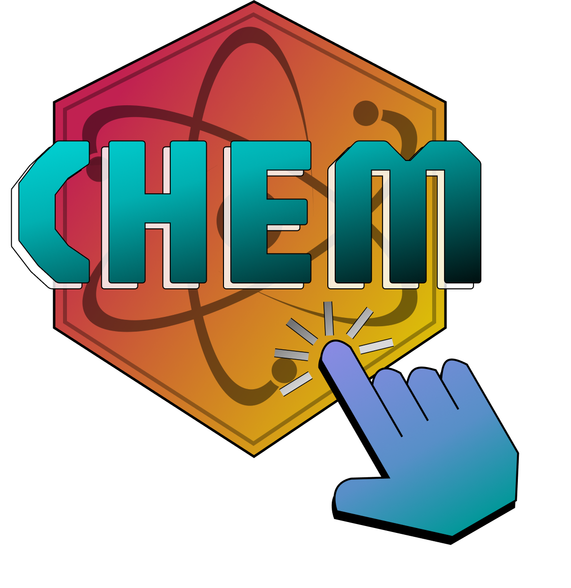
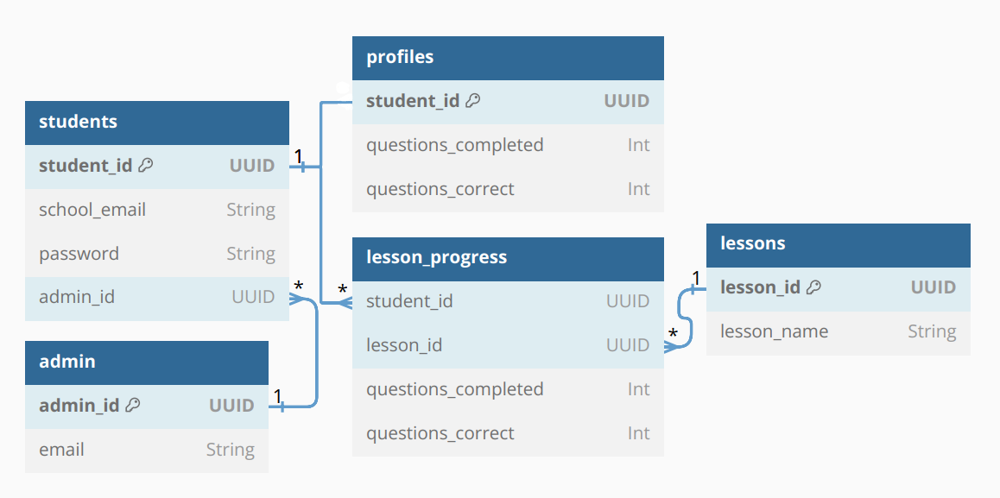

# ChemClicks
<a id="readme-top"></a>
<!-- PROJECT SHIELDS -->
<!--
*** I'm using markdown "reference style" links for readability.
*** Reference links are enclosed in brackets [ ] instead of parentheses ( ).
*** See the bottom of this document for the declaration of the reference variables
*** for contributors-url, forks-url, etc. This is an optional, concise syntax you may use.
*** https://www.markdownguide.org/basic-syntax/#reference-style-links
-->


<!-- PROJECT LOGO -->
<br />
<div align="center">
    
  </a>

  <h3 align="center">ChemClicks: An Interactive Educational Chemistry  Website</h3>
</div>

<!--TABLE OF CONTENTS-->
## Table of Contents
- [About The Project](#about-the-project)
  - [Built With](#built-with)
  - [Contributors](#contributors)
  - [Entity-Relationship Diagram (ERD)](#entity-relationship-diagram-erd)
- [Getting Started](#getting-started)
  - [Installation](#installation)
- [Testing](#running-tests)
- [License](#license)

<!-- ABOUT THE PROJECT -->
## About The Project


Code Blue has been tasked with creating a web application designed to facilitate learning of core high school chemistry concepts by serving as an interactive, dynamic, and autonomous learning tool. The focus is to encourage high school students to learn through interactivity rather than rote memorization. This website will house the unique curriculum of our client and will be designed with our client's students in mind.

This project is being undertaken by the development team Code Blue, composed of undergraduate students majoring in Computer Science at California State University, Sacramento. Its members consist of Anthony Dominguez, Danica Galang, Oliver Jezildzic, Isabel Santoyo-Garcia, Marilyn Sarabia, Maria Valencia, Jessica Villanueva, and Zhenkang Zhao.


<p align="right">(<a href="#readme-top">back to top</a>)</p>

### Built With

We are building this project using the following:
* [![React][React.js]][React-url] **React** - Frontend framework  
* [![Node.js][Node.js]][Node-url] **Node.js** - Server-side runtime environment  
* [![MongoDB][MongoDB]][MongoDB-url] **MongoDB** - Database  
* [![Django][Django]][Django-url] **Django** - Backend web framework  
* [![HTML][HTML]][HTML-url] **HTML** - Markup language
* [![CSS][CSS]][CSS-url] **CSS** - Styling language 
* [![JavaScript][JavaScript]][JavaScript-url] **JavaScript** - Programming language for frontend 
* [![Python][Python]][Python-url] **Python** - Backend programming language

<p align="right">(<a href="#readme-top">back to top</a>)</p>

<!-- CONTRIBUTORS -->
## Contributors
### Contact Us!
Anthony Dominguez - Email: <anthonyd24uc@gmail.com> <br>
Danica Galang - Email: <danica.k.galang@gmail.com> <br>
Oliver Jezildzic - Email: <Olijez55@gmail.com> <br>
Isabel Santoyo-Garcia - Email: <> <br>
Marilyn Sarabia - Email: <mkdso0527@gmail.com> <br>
Maria Valencia - Email: <Mariasworkspace1@gmail.com> <br>
Jessica Villanueva - Email: <jessicabvillanueva@gmail.com> <br>
Zhenkang Zhao - Email: <zhenkang209@gmail.com> <br>


<p align="right">(<a href="#readme-top">back to top</a>)</p>


<!-- ERD -->
## Entity-Relationship Diagram (ERD)

Below is the Entity-Relationship Diagram (ERD) for our project. This diagram represents the relationships between key entities in our database:

<div style="text-align: center;">
    
</div>

### Explanation

- **User**: Stores basic student information, including a unique `user_id`, `school_email`, hashed `password`.
- **Teacher_User**: Stores information about an administrator, including a unique `teacher_id`.
- **Lesson_Progress**: Tracks a student's progress per lesson with key information and statistics. 
- **Teacher_Lesson_Progress**: Separates teacher progress from student progress for each lesson. This is used if the teacher wants to demonstrate a lesson.
- **Lesson_Details**: Stores the admin's settings and preferences for each lesson, including `due_date` and `goal_level` indicating how many questions a student must get right in order to pass to the next lesson. 
- **Announcement**: Stores admin's anouncements to users on the website in `message`. The `post_number` attribute ensure the most recent announcement appears at the top.


<p align="right">(<a href="#readme-top">back to top</a>)</p>


<!-- GETTING STARTED -->
## Getting Started

To clone and run this application, you will need [Node.js](https://docs.npmjs.com/downloading-and-installing-node-js-and-npm) installed on your computer. You will also need [Python](https://www.python.org/downloads/).

**Versions**:
- Python 3.8.x+
- Node.js v20.x+
- npm 10.x+

### Installation

1. Clone the repo & change directories
   ```sh
   git clone https://github.com/isg28/ChemClick.git
   ```
  ```sh
   cd ChemClick
   ```
2. Initial Setup
    * Change directories into the ChemClick folder
      ```sh
      cd ChemClick
       ```
    * Install dependencies
      ```sh
      npm install
       ```
3. Setup Backend 
    * Change directories into the backend folder
      ```sh
      cd backend
       ```
    * Ensure environment variables are set up correctly
      - Rename `.env.example` to `.env` and fill in the required values.
    
    
<p align="right">(<a href="#readme-top">back to top</a>)</p>

<!-- DEPLOYMENT -->
## Deployment

<p align="right">(<a href="#readme-top">back to top</a>)</p>

<!--TESTING -->
## Running Tests
### Set up Jest for unit testing
This project uses [Jest](https://jestjs.io/) and [React Testing Library](https://testing-library.com/docs/react-testing-library/intro/) for unit testing. Jest should have already been installed when dependencies were installed for the project. Follow these steps to run tests:

* Execute all tests:
  ```sh
    npm test
  ```
* Run tests in watch mode (automatically re-runs on changes):
  ```sh
    npm test -- --watch
  ```
Testing files can be found here:
  ```sh
  chemclick/
    frontend/
      src/
        tests/    # Testing folder
          login/      # Component folder
            login.test.js   # Test file
  ```

<p align="right">(<a href="#readme-top">back to top</a>)</p>

<!-- LICENSE -->
## License

!! INCLUDE DISTRIBUTING LICENSE !!

<p align="right">(<a href="#readme-top">back to top</a>)</p>

<!-- MARKDOWN LINKS & IMAGES -->
[React.js]: https://img.shields.io/badge/React-20232A?style=for-the-badge&logo=react&logoColor=61DAFB
[React-url]: https://reactjs.org/
[Node.js]: https://img.shields.io/badge/Node.js-339933?style=for-the-badge&logo=nodedotjs&logoColor=white
[Node-url]: https://nodejs.org/
[MongoDB]: https://img.shields.io/badge/MongoDB-47A248?style=for-the-badge&logo=mongodb&logoColor=white
[MongoDB-url]: https://www.mongodb.com/
[Django]: https://img.shields.io/badge/Django-092E20?style=for-the-badge&logo=django&logoColor=white
[Django-url]: https://www.djangoproject.com/
[HTML]: https://img.shields.io/badge/HTML-E34F26?style=for-the-badge&logo=html5&logoColor=white
[HTML-url]: https://developer.mozilla.org/en-US/docs/Web/HTML
[CSS]: https://img.shields.io/badge/CSS-1572B6?style=for-the-badge&logo=css3&logoColor=white
[CSS-url]: https://developer.mozilla.org/en-US/docs/Web/CSS
[JavaScript]: https://img.shields.io/badge/JavaScript-F7DF1E?style=for-the-badge&logo=javascript&logoColor=black
[JavaScript-url]: https://developer.mozilla.org/en-US/docs/Web/JavaScript
[Python]: https://img.shields.io/badge/Python-3776AB?style=for-the-badge&logo=python&logoColor=white
[Python-url]: https://www.python.org/


