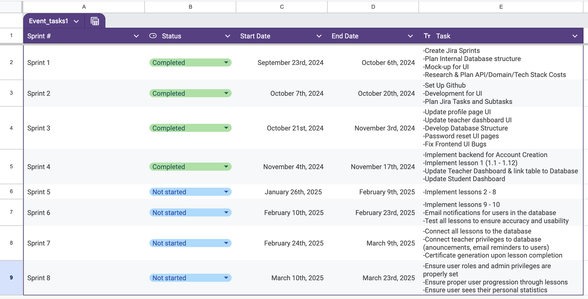
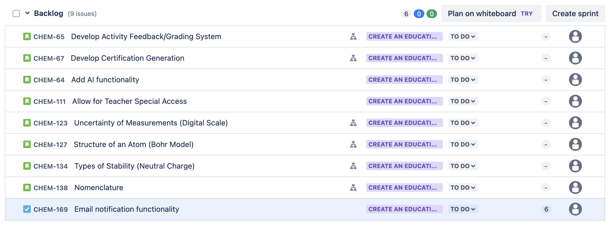
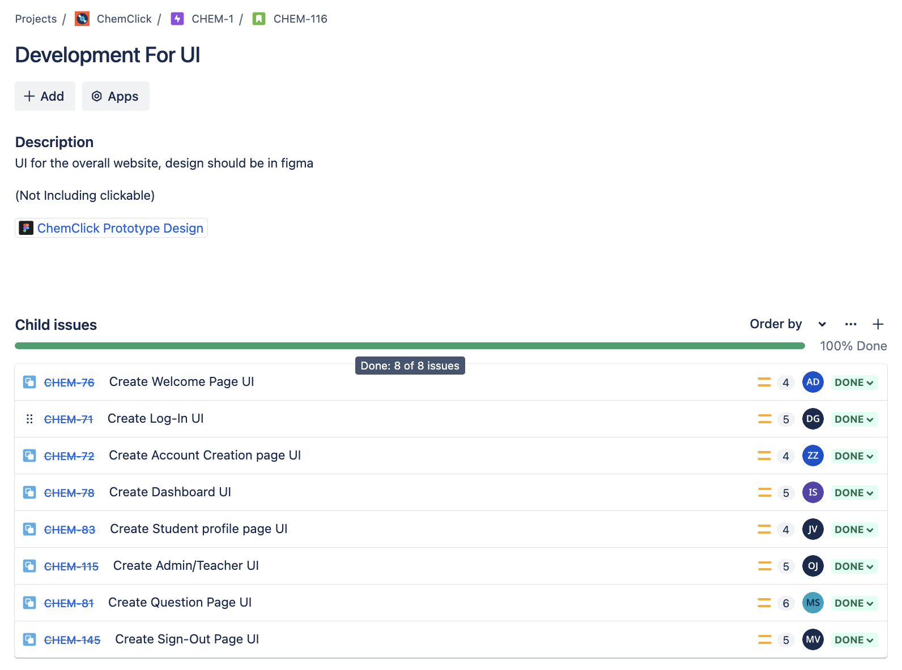

# ChemClicks
<a id="readme-top"></a>
<!-- PROJECT SHIELDS -->
<!--
*** I'm using markdown "reference style" links for readability.
*** Reference links are enclosed in brackets [ ] instead of parentheses ( ).
*** See the bottom of this document for the declaration of the reference variables
*** for contributors-url, forks-url, etc. This is an optional, concise syntax you may use.
*** https://www.markdownguide.org/basic-syntax/#reference-style-links
-->


<!-- PROJECT LOGO -->
<br />
<div align="center">
    
  </a>

  <h3 align="center">ChemClicks: An Interactive Chemistry Learning Website</h3>
</div>

<!--TABLE OF CONTENTS-->
## Table of Contents
- [About The Project](#about-the-project)
  - [Built With](#built-with)
  - [Entity-Relationship Diagram (ERD)](#entity-relationship-diagram-erd)
- [Getting Started](#getting-started)
  - [Prerequisites](#prerequisites-installing-nodejs-react-framework-python-and-mongodb)
  - [Installation](#installation)
  - [Running Locally](#running-locally)

<!-- ABOUT THE PROJECT -->
## About The Project


Code Blue has been tasked with creating a web application designed to facilitate learning of core high school chemistry concepts by serving as an interactive, dynamic, and autonomous learning tool.  The focus is to encourage high school students to learn by creating knowledge rather than just recollecting it. This website will house the curriculum of our client and will be designed with our client's students in mind.

This project is being undertaken by the development team Code Blue, composed of undergraduate students majoring in Computer Science at California State University, Sacramento. Its members consist of Jessica Villanueva, Danica Galang, Isabel Santoyo-Garcia, Anthony Dominguez, Maria Valencia, Marilyn Sarabia, Zhenkang Zhao, and Oliver Jezildzic.


<p align="right">(<a href="#readme-top">back to top</a>)</p>

### Built With

We are building this project using the following:
* [![React][React.js]][React-url] **React** - Frontend framework  
* [![Node.js][Node.js]][Node-url] **Node.js** - Server-side runtime environment  
* [![MongoDB][MongoDB]][MongoDB-url] **MongoDB** - Database  
* [![Django][Django]][Django-url] **Django** - Backend web framework  
* [![HTML][HTML]][HTML-url] **HTML** - Markup language
* [![CSS][CSS]][CSS-url] **CSS** - Styling language 
* [![JavaScript][JavaScript]][JavaScript-url] **JavaScript** - Programming language for frontend 
* [![Python][Python]][Python-url] **Python** - Backend programming language

<p align="right">(<a href="#readme-top">back to top</a>)</p>

<!-- TIME LINE -->
## Project Timeline
At this moment, we've completed the first part of senior project (Fall semester 2024). We will continue this project in the Spring semester during the second part of senior project. Here is our projected timeline and what we expect to get done during that phase of the development process.

<div style="text-align: center;">
    
</div>

### Explanation
This is a very high-level overview of what we plan to develop in the Spring. Thus, these are the major milestones that we hope to accomplish to be on track to present our final product for senior showcase. Within these major milestones will be multiple sub-tasks that we will individually assign to each developer with story points to indicate difficulty and time spent on the task. There will also be acceptance criteria that each developer must complete for their task in order for it to be considered finished and marked "done". 

Additionally, as part of our project management, here is an example of the tasks that we have in the backlog that we will assign to sprints according to their priority.

<div style="text-align: center;">
    
</div>

Finally, here is an example of a story that we've created sub-tasks for in Jira and assigned to developers whose responsibility it was to finish coding before the sprint ended.

<div style="text-align: center;">
    
</div>

### Current Status
Out of eight total sprints, we have finished four during the Fall semester and are looking forward to continue development in the next four sprints during the Spring semester of 2025.

<p align="right">(<a href="#readme-top">back to top</a>)</p>


<!-- ERD -->
## Entity-Relationship Diagram (ERD)

Below is the current Entity-Relationship Diagram (ERD) for our project. This diagram represents the relationships between key entities in our database:

<div style="text-align: center;">
    
</div>

### Explanation

- **Students**: Stores basic student information, including a unique `student_id`, `school_email`, hashed `password`, and `admin_id`.
- **Admin**: Stores information about an administrator, including a unique `admin_id` and `email`.
- **Profiles**: Tracks a student's overall progress with `questions_completed` and `questions_correct`. 
- **Lessons**: Contains a unique `lesson_id` and `lesson_name` for each lesson. 
- **Lesson Progress**: Records each student's performance in individual lessons, including `questions_completed` and `questions_correct`. 


### How Data Flows Between Entities
- **Students**: This is the main table that holds the primary information about users (students). Each student:
  - Is assigned to a specific admin through `admin_id` (many-to-one relationship).
  - Has a single profile that tracks their overall progress (one-to-one relationship).
  - Can have multiple lesson progress records (one-to-many relationship).
- **Admin**: Manages multiple students via the `admin_id` field in the `Students` table (one-to-many relationship).
- **Profiles**: Aggregates the overall progress data for each student, linked via `student_id` (one-to-one relationship).
- **Lessons**: Stores information about each lesson and connects to Lesson_Progress for tracking student activity (independent table).
- **Lesson Progress**: Tracks individual student performance for specific lessons. Acts as a bridge table:
  - Links each entry to a specific student via `student_id` (many-to-one relationship).
  - Links each entry to a specific lesson via `lesson_id` (many-to-one relationship).


### Current Status
- The ERD is still a work in progress as we refine and expand the database structure to accommodate additional features.

<p align="right">(<a href="#readme-top">back to top</a>)</p>


<!-- GETTING STARTED -->
## Getting Started

To get a local copy up and running follow these simple example steps.

### Prerequisites: Installing Node.js, React framework, Python, and MongoDB

* npm and node.js installation on MacOS
  ```sh
  # installs nvm (Node Version Manager)
  curl -o- https://raw.githubusercontent.com/nvm-sh/nvm/v0.40.0/install.sh | bash
  # download and install Node.js (you may need to restart the terminal)
  nvm install 22
  # verifies the right Node.js version is in the environment
  node -v 
  # verifies the right npm version is in the environment
  npm -v 
  ```
* npm and node.js installation on Windows
  ```sh
  # installs fnm (Fast Node Manager)
  winget install Schniz.fnm
  # configure fnm environment
  fnm env --use-on-cd | Out-String | Invoke-Expression
  # download and install Node.js
  fnm use --install-if-missing 22
  # verifies the right Node.js version is in the environment
  node -v 
  # verifies the right npm version is in the environment
  npm -v 
  ```
* Installing Python

      Make sure you have Python 3.8+ installed. You can download it here: https://www.python.org/downloads/
* MongoDB Setup

      Ensure MongoDB is installed and running. You can download MongoDB here: https://www.mongodb.com/try/download/community


### Installation

1. Clone the repo & change directories
   ```sh
   git clone https://github.com/isg28/ChemClick.git
   cd ChemClick
   ```
2. Change git remote url to avoid accidental pushes to base project
   ```sh
   git remote set-url origin github_username/repo_name
   git remote -v # confirm the changes
   ```
3. Initial Setup
    * Change directories into the ChemClick folder
      ```sh
      cd ChemClick
       ```
    * Install Mongoose, NodeJS, and other packages
      ```sh
      npm i express ejs 
      npm i mongoose 
      npm install concurrently --save-dev
      npm i cors 
      npm install node.js
       ```
3. Setup Backend 

    * Change directories into the backend folder
      ```sh
      cd backend
       ```
    
    * create a virtual environment
      ```sh
      python -m venv venv
      source venv/bin/activate  # On Windows, use: venv\Scripts\activate
       ```
      
    * Install Django and other packages
      ```sh
      pip install django djangorestframework django-cors-headers mongoengine pymongo python-dotenv
      ```
    * Start the backend servers
      ```sh
      python manage.py runserver
      ```
4. Setup Frontend
   * Open a new terminal & change directories into frontend folder 
       ```sh
       cd frontend
       ```
   * Install NPM packages
       ```sh
       npm install
       ```
   * Run the frontend server
       ```sh
       npm start
       ```
5. Access the Application
   * Open your browser and access the web application at http://localhost:3000/
<p align="right">(<a href="#readme-top">back to top</a>)</p>

### Running Locally
  1. Clone the project

      ```sh
      git clone https://github.com/isg28/ChemClick.git
      cd ChemClick
      ```

  2. Set up backend in new terminal
      ```sh
      # Change directories into backend folder
      cd backend
      # Install necessary packages and libraries
      pip install django djangorestframework django-cors-headers mongoengine pymongo python-dotenv
      # Run backend
      python manage.py runserver
      ```
  3. Set up frontend in new terminal
      ```sh
      # Change directories into frontend folder
      cd frontend
      # Install necessary packages and libraries for frontend
      npm install
      # Start up frontend server
      npm start
      ```

### Deployment

<!--TESTING -->
## Running Tests
To be continued in CSC191
<p align="right">(<a href="#readme-top">back to top</a>)</p>


<!-- MARKDOWN LINKS & IMAGES -->
[React.js]: https://img.shields.io/badge/React-20232A?style=for-the-badge&logo=react&logoColor=61DAFB
[React-url]: https://reactjs.org/
[Node.js]: https://img.shields.io/badge/Node.js-339933?style=for-the-badge&logo=nodedotjs&logoColor=white
[Node-url]: https://nodejs.org/
[MongoDB]: https://img.shields.io/badge/MongoDB-47A248?style=for-the-badge&logo=mongodb&logoColor=white
[MongoDB-url]: https://www.mongodb.com/
[Django]: https://img.shields.io/badge/Django-092E20?style=for-the-badge&logo=django&logoColor=white
[Django-url]: https://www.djangoproject.com/
[HTML]: https://img.shields.io/badge/HTML-E34F26?style=for-the-badge&logo=html5&logoColor=white
[HTML-url]: https://developer.mozilla.org/en-US/docs/Web/HTML
[CSS]: https://img.shields.io/badge/CSS-1572B6?style=for-the-badge&logo=css3&logoColor=white
[CSS-url]: https://developer.mozilla.org/en-US/docs/Web/CSS
[JavaScript]: https://img.shields.io/badge/JavaScript-F7DF1E?style=for-the-badge&logo=javascript&logoColor=black
[JavaScript-url]: https://developer.mozilla.org/en-US/docs/Web/JavaScript
[Python]: https://img.shields.io/badge/Python-3776AB?style=for-the-badge&logo=python&logoColor=white
[Python-url]: https://www.python.org/


