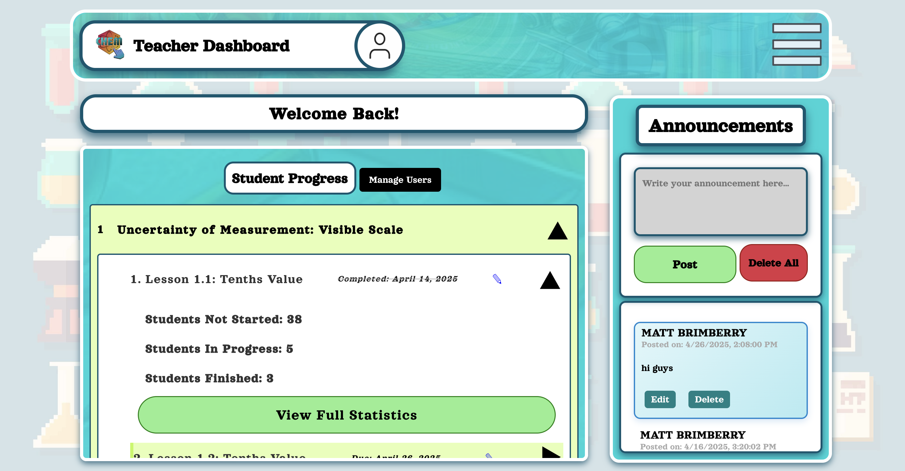

# ChemClicks
<a id="readme-top"></a>
<!-- PROJECT SHIELDS -->
<!--
*** I'm using markdown "reference style" links for readability.
*** Reference links are enclosed in brackets [ ] instead of parentheses ( ).
*** See the bottom of this document for the declaration of the reference variables
*** for contributors-url, forks-url, etc. This is an optional, concise syntax you may use.
*** https://www.markdownguide.org/basic-syntax/#reference-style-links
-->


<!-- PROJECT LOGO -->
<br />
<div align="center">
    
  </a>

  <h3 align="center">ChemClicks: An Interactive Educational Chemistry  Website</h3>
</div>

<!--TABLE OF CONTENTS-->
## Table of Contents
- [About The Project](#about-the-project)
  - [Built With](#built-with)
  - [Contributors](#contributors)
  - [Entity-Relationship Diagram (ERD)](#entity-relationship-diagram-erd)
- [Getting Started](#getting-started)
  - [Installation](#installation)
- [Deployment](#deployment)
- [Testing](#running-tests)
- [User Interface](#user-interface)
- [License](#license)

<!-- ABOUT THE PROJECT -->
## About The Project

<div style="text-align: center;">
    
</div>


Code Blue has been tasked with creating a web application designed to facilitate learning of core high school chemistry concepts by serving as an interactive, dynamic, and autonomous learning tool. The focus is to encourage high school students to learn through interactivity rather than rote memorization. This website will house the unique curriculum of our client and will be designed with our client's students in mind.

This project is being undertaken by the development team Code Blue, composed of undergraduate students majoring in Computer Science at California State University, Sacramento. Its members consist of Anthony Dominguez, Danica Galang, Oliver Jezildzic, Isabel Santoyo-Garcia, Marilyn Sarabia, Maria Valencia, Jessica Villanueva, and Zhenkang Zhao.


<p align="right">(<a href="#readme-top">back to top</a>)</p>

### Built With

We are building this project using the following:
* [![React][React.js]][React-url] **React** - Frontend framework  
* [![Vercel][Vercel-img]][Vercel-url] **Vercel** – Frontend hosting and deployment  
* [![Node.js][Node.js]][Node-url] **Node.js** - Server-side runtime environment  
* [![MongoDB][MongoDB]][MongoDB-url] **MongoDB** - Database  
* [![Django][Django]][Django-url] **Django** - Backend web framework  
* [![Render][Render-img]][Render-url] **Render** – Backend deployment platform  
* [![HTML][HTML]][HTML-url] **HTML** - Markup language
* [![CSS][CSS]][CSS-url] **CSS** - Styling language 
* [![JavaScript][JavaScript]][JavaScript-url] **JavaScript** - Programming language for frontend 
* [![Python][Python]][Python-url] **Python** - Backend programming language

<p align="right">(<a href="#readme-top">back to top</a>)</p>

<!-- CONTRIBUTORS -->
## Contributors
### Contact Us!
**Anthony Dominguez - Email: <anthonyd24uc@gmail.com>** <br>
Danica Galang - Email: <danica.k.galang@gmail.com> <br>
**Oliver Jezildzic - Email: <Olijez55@gmail.com>** <br>
Isabel Santoyo-Garcia - Email: <isabelsantoyogarcia28@gmail.com> <br>
**Marilyn Sarabia - Email: <mkdso0527@gmail.com>** <br>
Maria Valencia - Email: <Mariasworkspace1@gmail.com> <br>
**Jessica Villanueva - Email: <jessicabvillanueva@gmail.com>** <br>
Zhenkang Zhao - Email: <zhenkang209@gmail.com> <br>


<p align="right">(<a href="#readme-top">back to top</a>)</p>


<!-- ERD -->
## Entity-Relationship Diagram (ERD)

Below is the Entity-Relationship Diagram (ERD) for our project. This diagram represents the relationships between key entities in our database:

<div style="text-align: center;">
    
</div>

### Explanation

- **User**: Stores basic student information, including a unique `user_id`, `school_email`, hashed `password`.
- **Teacher_User**: Stores information about an administrator, including a unique `teacher_id`.
- **Lesson_Progress**: Tracks a student's progress per lesson with key information and statistics. 
- **Teacher_Lesson_Progress**: Separates teacher progress from student progress for each lesson. This is used if the teacher wants to demonstrate a lesson.
- **Lesson_Details**: Stores the admin's settings and preferences for each lesson, including `due_date` and `goal_level` indicating how many questions a student must get right in order to pass to the next lesson. 
- **Announcement**: Stores admin's anouncements to users on the website in `message`. The `post_number` attribute ensure the most recent announcement appears at the top.


<p align="right">(<a href="#readme-top">back to top</a>)</p>


<!-- GETTING STARTED -->
## Getting Started

To clone and run this application, you will need [Node.js](https://docs.npmjs.com/downloading-and-installing-node-js-and-npm) installed on your computer. You will also need [Python](https://www.python.org/downloads/).

**Versions**:
- Python 3.8.x+
- Node.js v20.x+
- npm 10.x+

### Installation

1. Clone the repo & change directories
   ```sh
   git clone https://github.com/isg28/ChemClick.git
   ```
2. Initial Setup
    * Change directories into the ChemClick folder
      ```sh
      cd ChemClick
       ```
    * Install dependencies
      ```sh
      npm install
       ```
3. Setup Backend 
    * Change directories into the backend folder
      ```sh
      cd backend
       ```
    * Ensure environment variables are set up correctly
      - Rename `.env.example` to `.env` and fill in the required values.
4. Install Python Dependencies  
   * While in the `backend/` folder, install all required Python packages listed in `requirements.txt`:
   ```sh
   pip install -r requirements.txt
   ```

<p><br></p>
<p><br></p>

### Running the Application Locally
<p>To launch the full application, you must run both the backend and frontend servers simultaneously in two separate terminal windows or tabs:</p>

<ol>
  <li>
    <strong>Run the Django Backend Server</strong><br>
    From inside the <code>backend/</code> folder:
    <pre><code>python manage.py runserver</code></pre>
  </li>

  <li>
    <strong>Run the React Frontend Server</strong><br>
    From inside the <code>frontend/</code> folder:
    <pre><code>npm start</code></pre>
  </li>
</ol>

<p>This setup ensures both the backend API and frontend UI are running and communicating properly for local development.</p>

    
    
<p align="right">(<a href="#readme-top">back to top</a>)</p>

<!-- DEPLOYMENT -->
## Deployment

<ul>
  <li><strong>Backend:</strong> Hosted on 
    <a href="https://render.com/" target="_blank" rel="noopener noreferrer">Render</a>, 
    a cloud platform that automatically builds and deploys web services. 
    The backend uses <code>Gunicorn</code> as the WSGI server to serve the Django application.
    
  <div style="text-align: center; margin-top: 10px;">
      
      <p style="font-size: 14px;"><em>Deployment logs confirming successful server boot on Render.</em></p>
  </div>
  </li>

  <li><strong>Database:</strong> Integrated with 
    <a href="https://www.mongodb.com/cloud/atlas" target="_blank" rel="noopener noreferrer">MongoDB Atlas</a>, 
    a cloud-based NoSQL database. Environment variables were used to securely manage connection strings 
    and credentials.
  </li>

  <li><strong>Frontend:</strong> Deployed using 
    <a href="https://vercel.com/" target="_blank" rel="noopener noreferrer">Vercel</a>, 
    a frontend hosting platform optimized for React applications. It handles continuous deployment 
    from GitHub and automatically builds the project on each push.
  </li>
</ul>

<p><br></p>
<p>
  The live application is accessible at: 🎉
  <a href="https://chem-clicks.vercel.app" target="_blank" rel="noopener noreferrer">
    https://chem-clicks.vercel.app
  </a>🎉
</p>


<p align="right">(<a href="#readme-top">back to top</a>)</p>

<!--TESTING -->
## Running Tests
### Frontend Unit Testing (Jest)
This project uses [Jest](https://jestjs.io/) and [React Testing Library](https://testing-library.com/docs/react-testing-library/intro/) for unit testing. Jest should have already been installed when dependencies were installed for the project. Follow these steps to run tests:

* Navigate to the frontend folder:
  ```sh
    cd frontend
  ```
* Execute all tests:
  ```sh
    npm test
  ```
* Run tests in watch mode (automatically re-runs on changes):
  ```sh
    npm test -- --watch
  ```
Testing files can be found here:
  ```sh
  chemclick/
    frontend/
      src/
        tests/    # Testing folder
          login/      # Component folder
            login.test.js   # Test file
  ```

<p><br></p>
<p><br></p>


### Backend Unit Testing (Django + MongoMock)
<p>
  The backend uses Python’s built-in 
  <a href="https://docs.python.org/3/library/unittest.html" target="_blank" rel="noopener noreferrer">unittest</a> module, 
  along with 
  <a href="https://mongomock.readthedocs.io/en/latest/" target="_blank" rel="noopener noreferrer">mongomock</a> 
  to mock MongoDB interactions. Each test is isolated and does not affect production data.
</p>

<p>Follow these steps to run tests:</p>

  * Navigate to the backend folder:
    ```sh
      cd backend
    ```
  * Execute all tests:
    ```sh
      python -m unittest discover
    ```

<p>Testing files can be found here:</p>

  ```sh
  chemclick/
    backend/
      EmailService/
        tests.py                # Email notifications logic
      lessons/
        tests.py                # Lesson creation and progress tracking
      teacher/
        tests.py                # Teacher login
      teacherLessons/
        tests.py                # Teacher-specific progress tracking
      users/
        tests.py                # User creation and login
      announcements/
        tests.py                # Announcement CRUD operations
  ```

<p>Each backend test module includes:</p>
<ul>
  <li>In-memory MongoDB setup with <code>mongomock</code></li>
  <li>Validation of API responses using Django’s test client or DRF’s <code>APIClient</code></li>
  <li><code>print()</code> statements for visible test output in the terminal</li>
</ul>

<p align="right">(<a href="#readme-top">back to top</a>)</p>

<!-- USER INTERFACE -->
## User Interface

#### Log In Page
<div style="text-align: center;">
    
</div>

#### Student Dashboard
<div style="text-align: center;">
    
</div>

#### Lesson
<div style="text-align: center;">
    
</div>

#### Profile Page
<div style="text-align: center;">
    
</div>

#### Teacher Dashboard (Admin Access)
<div style="text-align: center;">
    
</div>

#### Statistics Page (Admin Access)
<div style="text-align: center;">
    
</div>

<p align="right">(<a href="#readme-top">back to top</a>)</p>

<!-- LICENSE -->
## License

!! INCLUDE DISTRIBUTING LICENSE !!

<p align="right">(<a href="#readme-top">back to top</a>)</p>

<!-- MARKDOWN LINKS & IMAGES -->
[React.js]: https://img.shields.io/badge/React-20232A?style=for-the-badge&logo=react&logoColor=61DAFB
[React-url]: https://reactjs.org/
[Node.js]: https://img.shields.io/badge/Node.js-339933?style=for-the-badge&logo=nodedotjs&logoColor=white
[Node-url]: https://nodejs.org/
[MongoDB]: https://img.shields.io/badge/MongoDB-47A248?style=for-the-badge&logo=mongodb&logoColor=white
[MongoDB-url]: https://www.mongodb.com/
[Django]: https://img.shields.io/badge/Django-092E20?style=for-the-badge&logo=django&logoColor=white
[Django-url]: https://www.djangoproject.com/
[HTML]: https://img.shields.io/badge/HTML-E34F26?style=for-the-badge&logo=html5&logoColor=white
[HTML-url]: https://developer.mozilla.org/en-US/docs/Web/HTML
[CSS]: https://img.shields.io/badge/CSS-1572B6?style=for-the-badge&logo=css3&logoColor=white
[CSS-url]: https://developer.mozilla.org/en-US/docs/Web/CSS
[JavaScript]: https://img.shields.io/badge/JavaScript-F7DF1E?style=for-the-badge&logo=javascript&logoColor=black
[JavaScript-url]: https://developer.mozilla.org/en-US/docs/Web/JavaScript
[Python]: https://img.shields.io/badge/Python-3776AB?style=for-the-badge&logo=python&logoColor=white
[Python-url]: https://www.python.org/
[Vercel-img]: https://img.shields.io/badge/Vercel-000?logo=vercel&logoColor=white
[Vercel-url]: https://vercel.com/
[Render-img]: https://img.shields.io/badge/Render-46E3B7?logo=render&logoColor=white
[Render-url]: https://render.com/


